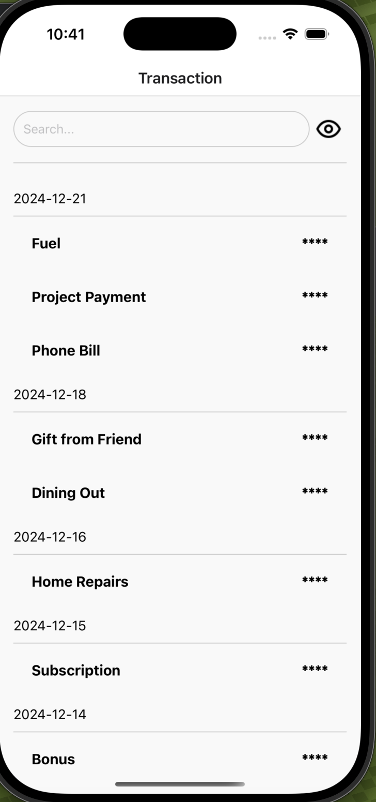
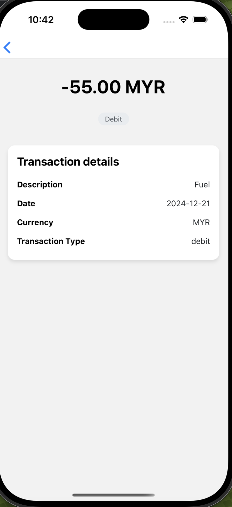

# Secure Transaction App

This is a mobile application built using React Native for iOS that allows users to securely view and manage their transaction history. The app is designed with a focus on security and performance, ensuring that sensitive financial data is handled with utmost care.

## Features
- User authentication and authorization.
- View transaction history (sample data)
- View detailed transaction history.
- Securely display sensitive financial data(amount).
- Mimic Real-time data updates(pull-down refresh feature).

### Screenshots

#### Transaction History View


#### Transaction Detail View


## Prerequisites

Before running the app, make sure you have the following installed:

- [Node.js](https://nodejs.org/en/)
- [React Native CLI](https://reactnative.dev/docs/environment-setup)
- [Xcode](https://developer.apple.com/xcode/) (for iOS development)
- [Android Studio](https://developer.android.com/studio) (for Android development)
- [JDK 17+](https://www.oracle.com/java/technologies/javase-jdk17-downloads.html)

### iOS Setup
1. **Install Xcode**: Download and install **Xcode** from the [Mac App Store](https://apps.apple.com/us/app/xcode/id497799835?mt=12).

2. **Clone the Repository**:
   ```
   git clone https://github.com/ScottTan98/TransactionHistoryDemo.git
   ```
3. **Install dependencies**: 
   ```
   npm install
   ```
4. **Run the app on an iOS simulator or connected device**: 
   ```
   npx react-native run-ios
   ```
5. **Troubleshooting iOS Build Issues**: If you encounter issues with the build process, try cleaning the project and reinstalling the dependencies:
   ```
   npx react-native clean
   npm install
   npx react-native run-ios
   ```

### Android Setup
1. **Install Android Studio**: Download and install Android Studio from [here](https://developer.android.com/studio).
2. **Clone the Repository**:
   ```
   git clone https://github.com/ScottTan98/TransactionHistoryDemo.git
   ```
3. **Install dependencies**: 
   ```
   npm install
   ```
4. **Set up Android Virtual Device (AVD)**
5. **Run the App on Android Emulator or Connected Device**: 
   ```
   npx react-native run-android
   ```
6. **Troubleshooting Android Build Issues**: If you encounter issues with the Android build, try cleaning the project and reinstalling dependencies:
   ```
   npx react-native clean
   npm install
   npx react-native run-android
   ```

### License 
This project is licensed under the MIT License - see the LICENSE file for details.

   

